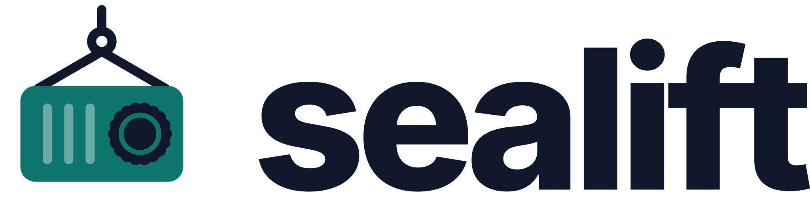
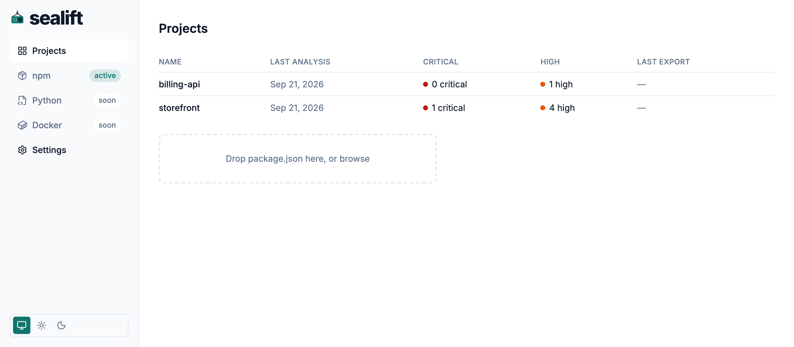
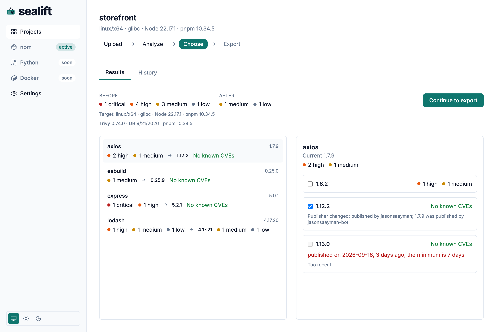
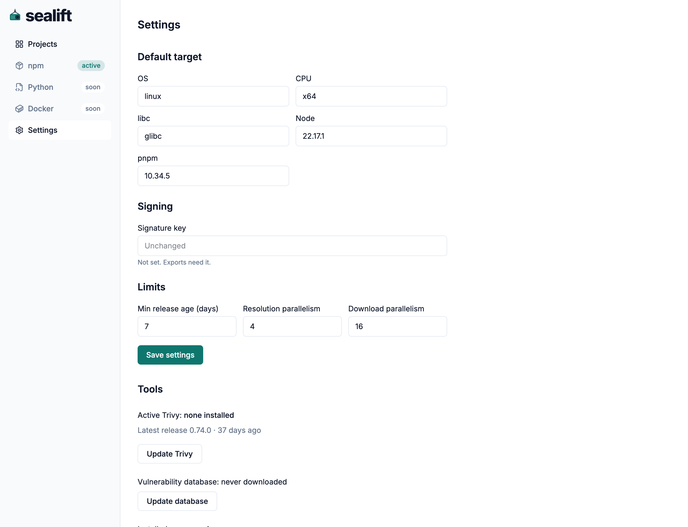

<p align="center">
  <picture>
    <source media="(prefers-color-scheme: dark)" srcset="web/src/assets/brand/lockup-dark.svg">
    
  </picture>
</p>

[](https://github.com/MorganKryze/sealift/actions/workflows/ci.yml)
[](https://github.com/MorganKryze/sealift/releases/latest)

sealift prepares npm dependency updates for air-gapped networks. It scans a project for known vulnerabilities, ranks the newer versions of each dependency, and packs the chosen versions into an archive an offline registry can import.

## Install

```sh
docker run -d \
  --name sealift \
  -p 127.0.0.1:8080:8080 \
  -v sealift-data:/data \
  ghcr.io/morgankryze/sealift:latest
```

`-p 127.0.0.1:8080:8080` keeps the interface off the network; reach it through a tunnel or a reverse proxy instead of publishing it further. The named volume `sealift-data` holds every project, analysis, export and setting, so it survives a container restart or upgrade.

Open `http://localhost:8080`.

## Usage

Create a project and upload its `package.json` and `pnpm-lock.yaml`.



Queue an analysis. sealift resolves the lockfile, scans it with Trivy, and lists the newer versions of each dependency, ranked by the CVEs they fix, whether they are a patch, a minor or a major jump, and whether they still resolve against the rest of the project. Pick a candidate for each dependency, or keep the one sealift already highlighted.



Before the first export, set a signature key and the target platform in Settings. sealift writes the key into every archive it packs, and resolves and downloads packages for the platform recorded there.



Queue an export with the chosen versions. sealift resolves the project against them, downloads the packages, and packs a `tar.gz` archive next to a CVE report and a version report. Download the archive from the export once it finishes.

## Configuration

Every setting lives on the Settings screen and applies to the next analysis or export.

| Setting | Changes |
| --- | --- |
| Target | The OS, CPU, libc, Node version and pnpm version sealift resolves and downloads packages for. |
| Signature key | Written into `signature.key` inside every export archive. Masked once set; sealift never logs it. |
| Minimum release age | How many days old a candidate version must be before ranking will pick it. |
| Resolve parallelism | How many candidate versions sealift resolves at once. |
| Download parallelism | How many package tarballs sealift downloads at once. |

## Development

Requires Go 1.27, Node 22, pnpm 12.3.4, [just](https://just.systems) and [golangci-lint](https://golangci-lint.run) 2.13.

```sh
just hooks      # link the pre-commit hook
just check      # formatting, vet, lint, race tests
just web-check  # typecheck, lint and test the web app
just generate   # regenerate the Go server and the web client from api/openapi.yaml
just image      # build the image for the host's own architecture
just e2e        # publish to a local registry, then pnpm install against it
```

## License

GPL-3.0. See [LICENSE](LICENSE).
