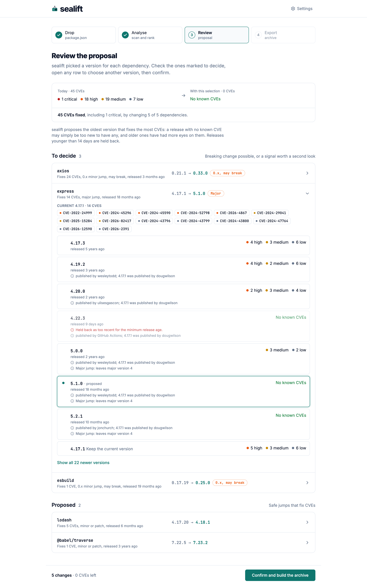
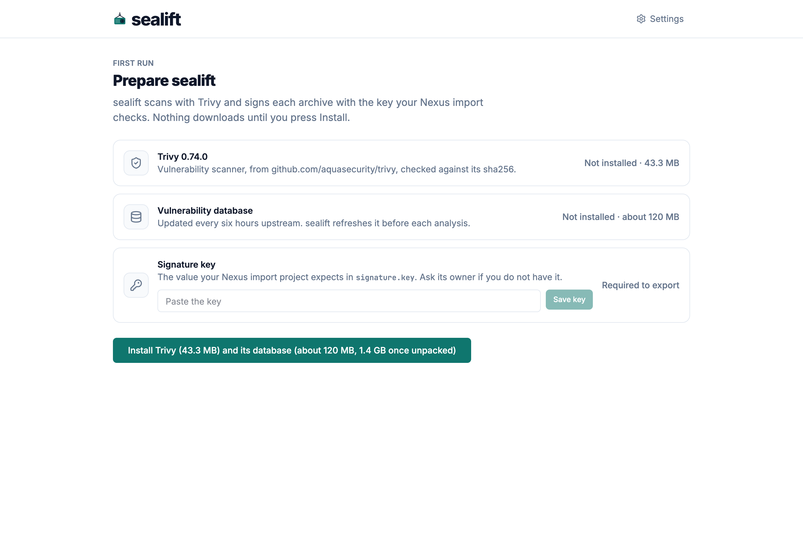
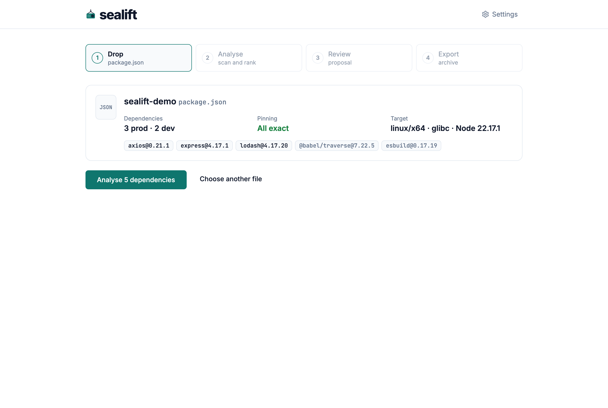
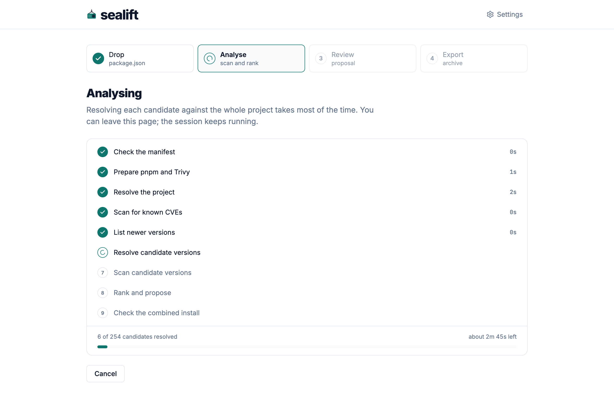
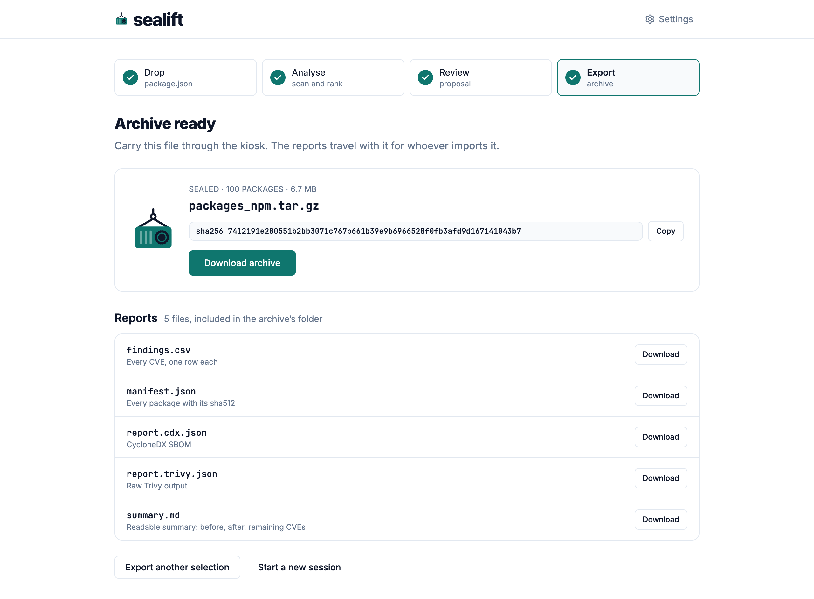

<p align="center">
  <picture>
    <source media="(prefers-color-scheme: dark)" srcset="web/src/assets/brand/lockup-dark.svg">
    
  </picture>
</p>

<p align="center">npm dependency updates for air-gapped networks, scanned, ranked and packed for the kiosk.</p>

<p align="center">
  <a href="https://github.com/MorganKryze/sealift/actions/workflows/ci.yml"></a>
  <a href="https://github.com/MorganKryze/sealift/releases/latest"></a>
  <a href="LICENSE"></a>
  <a href="https://github.com/MorganKryze/sealift/pkgs/container/sealift"></a>
</p>

<picture>
  <source media="(prefers-color-scheme: dark)" srcset="docs/assets/review-dark.png">
  
</picture>

## The problem

Updating one npm dependency on an air-gapped network means choosing a version on the connected side, carrying every package it pulls in through the kiosk, and importing them into the offline registry. A version picked by hand often misses a transitive package, carries CVEs of its own, or turns out too new to trust. Each miss costs another round trip through the kiosk, and a round trip takes days.

## What sealift does

On the connected side, from a project's `package.json`:

- scans the project with Trivy and counts its CVEs by severity;
- resolves every newer version of each direct dependency with the project's peer dependencies, and scans each one;
- proposes, for each dependency, the oldest version that fixes the most CVEs, and holds back any release younger than 14 days;
- flags what deserves a second look: a major jump, a lost provenance, a new publisher, an added install script;
- lets you review the proposal, change any version, or keep the current one;
- downloads every package the selection needs, checks each one against the registry's sha512, and packs a reproducible archive.

On the air-gapped side, the team receives:

- `packages_npm.tar.gz`, with every package the new versions need and the `signature.key` the Nexus import checks;
- `manifest.json`, with the hashes of every package and of the archive;
- `summary.md` and `findings.csv`, with the CVEs before and after, and what remains;
- a CycloneDX SBOM and Trivy's raw report.

## How it works

| | |
| --- | --- |
|  |  |
| **Setup.** sealift lists Trivy, its database and the signature key, with their sizes, and downloads nothing until you press Install. | **Drop.** Drop a `package.json`. The preview checks that each direct dependency is pinned before anything runs. |
|  |  |
| **Analyse.** sealift resolves and scans every candidate, and shows each step with the time left. The session runs on without the page. | **Export.** Confirm the review. sealift downloads, verifies and packs the archive, then shows its sha256 and the reports. |

## Quickstart

```sh
docker run -d --name sealift -p 127.0.0.1:8080:8080 -v sealift-data:/data ghcr.io/morgankryze/sealift:latest
```

Open <http://localhost:8080>. [Getting started](docs/getting-started.md) walks through a first archive in about ten minutes.

## Documentation

| Need | Pages |
| --- | --- |
| Start | [Getting started](docs/getting-started.md), [Workflow](docs/workflow.md) |
| Use | [How sealift chooses](docs/how-sealift-chooses.md), [Settings](docs/settings.md), [The air gap](docs/air-gap.md) |
| Deploy | [Deployment](docs/deployment.md), [Troubleshooting](docs/troubleshooting.md), [FAQ](docs/faq.md) |
| Develop | [Contributing](CONTRIBUTING.md), [Architecture](docs/dev/architecture.md), [Ranking](docs/dev/ranking.md), [API](docs/dev/api.md), [Archive format](docs/dev/archive-format.md), [Web](docs/dev/web.md) |

[docs/README.md](docs/README.md) lists every page with a line on each.

## Current limits

- npm only. Python packages and Docker images are not handled.
- The input is a `package.json` whose direct dependencies are pinned to exact versions. Lockfiles, workspaces, `overrides` and `resolutions` are not read.
- sealift proposes new versions for direct dependencies. Transitive packages change through them, and the minimum release age does not apply to them.
- `signature.key` is a shared value in plain text, not a cryptographic signature.
- A malicious package with no published CVE passes the scan.
- sealift has no login: keep it on `127.0.0.1` or behind an authenticating proxy.

## License

GPL-3.0. See [LICENSE](LICENSE).
