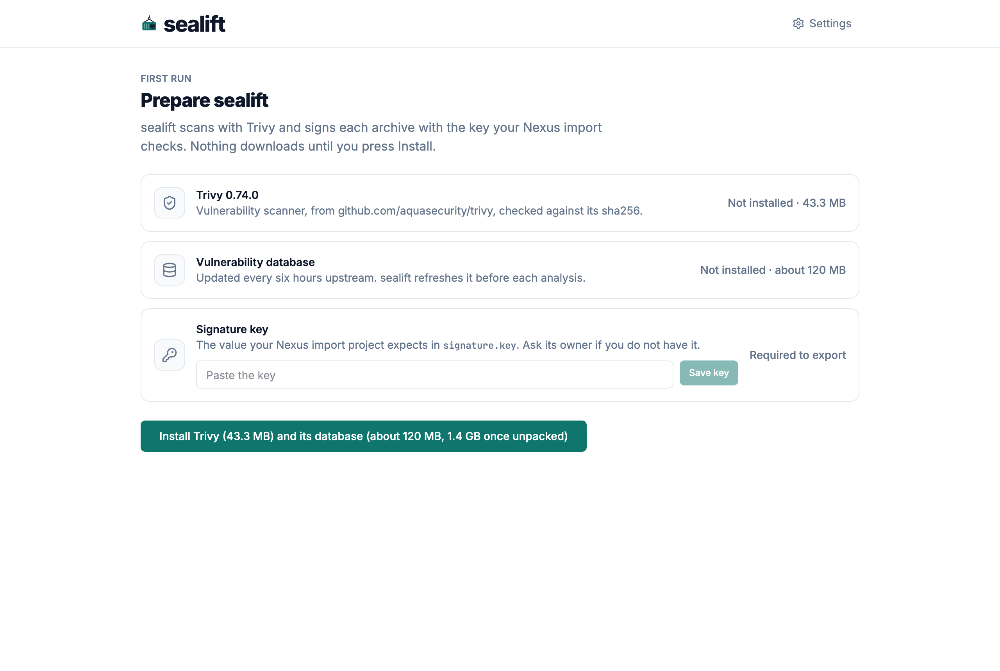
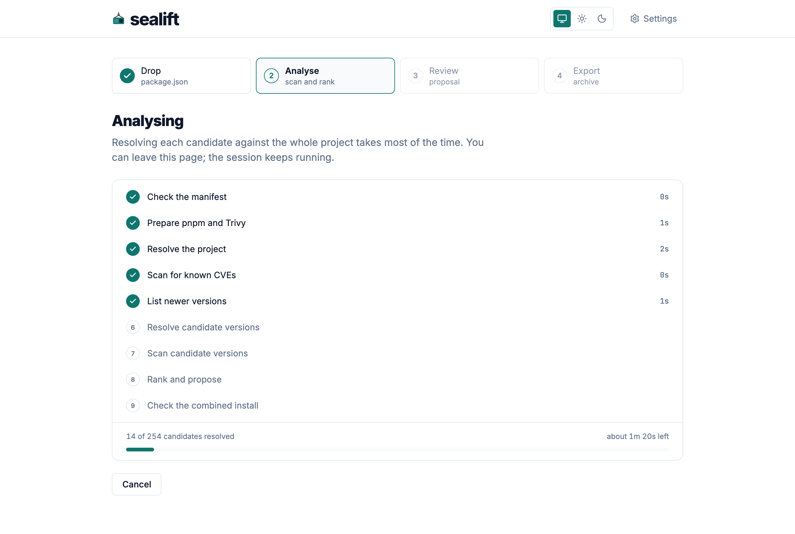
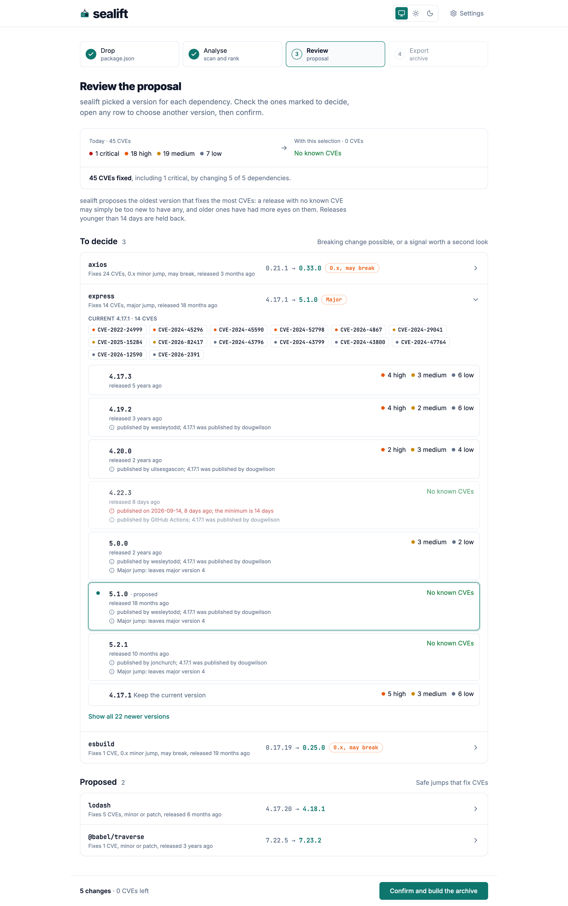
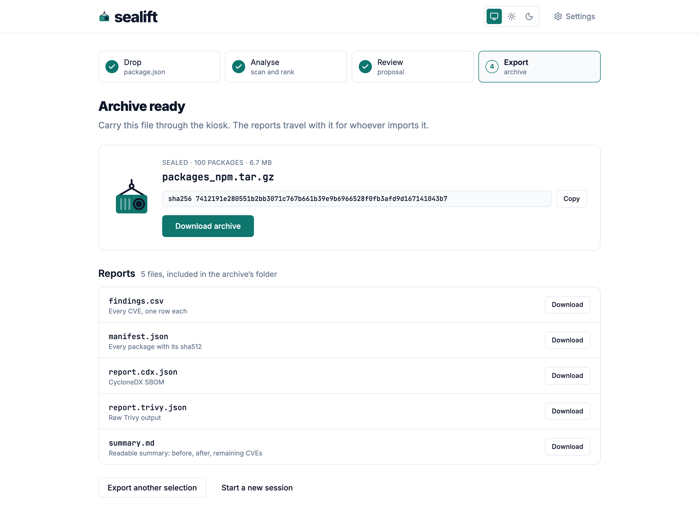

<p align="center">
  <picture>
    <source media="(prefers-color-scheme: dark)" srcset="web/src/assets/brand/lockup-dark.svg">
    
  </picture>
</p>

[](https://github.com/MorganKryze/sealift/actions/workflows/ci.yml)
[](https://github.com/MorganKryze/sealift/releases/latest)

sealift prepares npm dependency updates for air-gapped networks. It scans a project for known vulnerabilities, ranks the newer versions of each dependency, and packs the chosen versions into an archive an offline registry can import.

## Install

```sh
docker run -d \
  --name sealift \
  -p 127.0.0.1:8080:8080 \
  -v sealift-data:/data \
  ghcr.io/morgankryze/sealift:latest
```

`-p 127.0.0.1:8080:8080` keeps the interface off the network; reach it through a tunnel or a reverse proxy instead of publishing it further. The named volume `sealift-data` holds every project, analysis, export and setting, so it survives a container restart or upgrade.

Open `http://localhost:8080`.

## Usage

On first run, sealift asks for Trivy, its vulnerability database and the signature key your Nexus import checks. It downloads nothing until you press Install, then shows each tool downloading and ready before you continue. When the latest Trivy release is younger than the minimum release age, it offers the newest release past that age instead.



Drop a project's `package.json`. Its direct dependencies must be pinned to exact versions; the preview lists anything sealift would refuse before you start. If you dropped the same file before, sealift offers to resume that session.

sealift resolves the project, scans it with Trivy, lists the newer versions of each dependency, and resolves each candidate against the rest of the project. The screen shows each step as it finishes, with the time left. You can close the page; the session keeps running.



Review sealift's proposal. For each dependency it picks the oldest version that fixes the most CVEs, and holds back any release younger than the minimum release age. A proposal that is a major jump, or a 0.x minor jump, waits under "To decide". Open a row to see the CVE ids behind the current version, then choose another candidate or keep the current one.



Confirm the selection. sealift resolves the project against it, downloads each package, checks its integrity, and packs `packages_npm.tar.gz` with the signature key, next to a CVE report, a CycloneDX SBOM and a summary. Carry the archive through your kiosk and import it on the air-gapped side.



## Configuration

Every setting lives in the Settings panel, opened from the header, and applies to the next analysis or export. The panel also holds the light, dark or system theme.

| Setting | Changes |
| --- | --- |
| Target | The OS, CPU, libc, Node version and pnpm version sealift resolves and downloads packages for. |
| Signature key | Written into `signature.key` inside every export archive. Masked once set; sealift never logs it. |
| Minimum release age | How many days old a release must be before sealift proposes it or installs it as Trivy. 14 by default. |
| Resolve parallelism | How many candidate versions sealift resolves at once. |
| Download parallelism | How many package tarballs sealift downloads at once. |

## Development

Requires Go 1.27, Node 22, pnpm 12.3.4, [just](https://just.systems) and [golangci-lint](https://golangci-lint.run) 2.13.

```sh
just hooks      # link the pre-commit hook
just check      # formatting, vet, lint, race tests
just web-check  # typecheck, lint and test the web app
just generate   # regenerate the Go server and the web client from api/openapi.yaml
just image      # build the image for the host's own architecture
just e2e        # publish to a local registry, then pnpm install against it
```

## License

GPL-3.0. See [LICENSE](LICENSE).
