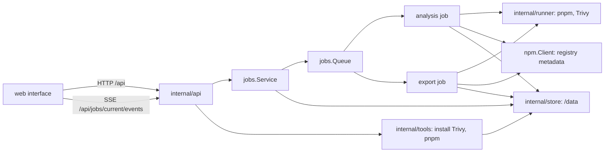

# Architecture

This page describes how a request becomes a queued job, what an analysis and an export do step by step, and how the `/data` volume is laid out. It is written for contributors; [Contributing](../../CONTRIBUTING.md) covers the setup.

## Overview

sealift is one Go binary. It serves the API under `/api`, the event stream of the running job, and the React interface, embedded from `web/dist/app` by `web/embed.go`.



| Package | Role |
| --- | --- |
| `cmd/sealift` | Flags (`-addr`, `-data`), wiring, the tools user from `SEALIFT_TOOLS_UID` and `SEALIFT_TOOLS_GID` |
| `internal/api` | Handlers for the strict server generated from `api/openapi.yaml`, problem responses, the event stream |
| `internal/jobs` | `Service`, `Queue`, the analysis and export jobs |
| `internal/store` | Every read and write under `/data`, settings validation |
| `internal/tools` | Trivy install and activation, pnpm install, hash checks |
| `internal/runner` | pnpm and Trivy command lines, run as the tools user in their own process group |
| `npm` | `package.json` parsing and validation, the registry client, pnpm lockfiles, version order |
| `rank` | Finding sets, severity vectors, signals, `Best`, `KeyVersions`, `Diff` |
| `archive` | The reproducible `tar.gz` writer |
| `sbom`, `internal/report` | CycloneDX, `summary.md`, `findings.csv` |

## Requests and jobs

A handler never touches the queue or the store layout. It calls `jobs.Service`, which validates the request, creates the job's directory in the store, and submits the job to the queue.

`jobs.Queue` runs one job at a time, in submission order, in memory. Each job emits events while it runs: `step`, `progress`, `candidate` and `log`. The queue appends one `end` event with the final state once the job returns.

`GET /api/jobs/current/events` streams those events. A new subscriber first receives every `step` event of the running job and its most recent other events, up to 128, then the live ones, so a reload rebuilds the screen.

Every event carries `storeId`, the directory id the store and the client use for the analysis or export. The queue's own job id is assigned per submission and does not survive a restart, and the service drops a job from its index once it ends. The queue stamps `storeId` on every event itself, the `end` event included, so the interface can match the final event to its screen without a lookup that could miss.

A job cancelled while still queued never runs. `Service` finalizes its directory, and those of failed and cancelled jobs, from a background goroutine that watches the queue's `end` events.

## The analysis

`internal/jobs/analysis.go` runs nine steps. Each has an id, which the events and `status.json` carry, and a label in the interface.

| # | Id | Label | What it does |
| --- | --- | --- | --- |
| 1 | `validate` | Check the manifest | `npm.Manifest.Validate`: exact versions, no unsupported field |
| 2 | `prepare-tools` | Prepare pnpm and Trivy | Installs pnpm if missing, refreshes the Trivy database; a failed refresh keeps the old one and records a warning |
| 3 | `resolve-project` | Resolve the project | `pnpm install --lockfile-only` for the target platform |
| 4 | `scan-project` | Scan for known CVEs | Trivy on the resolved project |
| 5 | `list-candidates` | List newer versions | Registry metadata, `npm.NewerStable`, `rank.KeyVersions` |
| 6 | `resolve-candidates` | Resolve candidate versions | Each candidate in isolation, key versions first, `resolveParallelism` at a time |
| 7 | `scan-candidates` | Scan candidate versions | Trivy on every candidate resolution |
| 8 | `rank` | Rank and propose | `rank.Signals`, `rank.Best` per dependency |
| 9 | `check-combined` | Check the combined install | Resolves the project with every proposal at once; a conflict is a warning, not a failure |

Step 6 dominates the time. A candidate resolution is a small project holding only that dependency at that version, plus the project's own version of each peer dependency it declares (`buildProbeManifest` in `analysis_helpers.go`). A candidate that fails to resolve gets the `does-not-resolve` signal; the job goes on.

A failing step stops the job. Its id and message go into `status.json` as the failure, and the interface shows them under What went wrong. [Ranking](ranking.md) covers steps 5 to 8 in detail.

## The export

`internal/jobs/export.go` builds the archive from an analysis and a selection of versions.

| Id | Label | What it does |
| --- | --- | --- |
| `package-list` | List the packages to export | Merges the lockfiles the analysis wrote for each selected version, adds the project's own when `includeProject` is set, and keeps the packages for the target platform |
| `download` | Download and verify each package | Fetches each tarball, `downloadParallelism` at a time, checks it against the lockfile's sha512, fills the shared cache |
| `strip` | Strip publishConfig | Rewrites the tarballs whose `package.json` holds `publishConfig` |
| `archive` | Pack and sign the archive | Writes `out/*.tgz` and `out/signature.key` with `archive.WriteTarGz` |
| `reports` | Write the reports | `manifest.json`, `summary.md`, `findings.csv`, and Trivy's `report.cdx.json` and `report.trivy.json` |

The export refuses a selection that names a version the analysis did not resolve (`ErrInvalidSelection`) and one that packs nothing (`ErrNothingToExport`). A tarball that does not match its integrity stops the export: nothing is packed from a file sealift could not verify. [Archive format](archive-format.md) describes the output.

## The data volume

```
/data
  private/settings.json          settings and the signature key, mode 0600, app only
  projects/<project>/
    project.json                 name, target, the manifest's sha256
    package.json                 the manifest as dropped
    analyses/<id>/
      status.json                state, steps, failure
      package.json               the manifest this analysis ran on
      log.txt                    what pnpm and Trivy wrote
      project/                   the project's resolution: pnpm-lock.yaml
      project.trivy.json         the project's scan
      candidates/, candidates.json, candidates.trivy.json
      ranking.json               the result the review reads
      combined/, combined.trivy.json
    exports/<id>/                the archive and its five reports
  tools/trivy/<version>/, tools/trivy/current
  tools/pnpm/<version>/
  trivy-cache/db/
  cache/pnpm/, cache/resolve/, cache/tarballs/
  home/                          HOME for pnpm and Trivy
```

Analysis and export ids are UTC timestamps with second precision, such as `20260923T120255Z`. A job writes into a pending directory, and the store commits it under its final name once the job ends, so a half-written directory never shows up in a listing.

The server runs as `app`; pnpm and Trivy run as `tools`, in the shared `data` group. `private/` is readable by `app` only, so the tools cannot read the settings.
