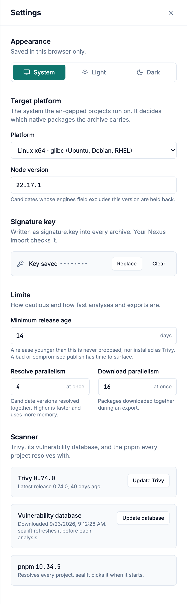

# Settings

This page describes each setting: what it changes, its range and its default. **Settings**, in the header, opens the panel over the current screen. A change applies to the next analysis or export; one that is running keeps the values it started with.



When a field changes, a bar at the bottom shows Unsaved changes, with **Save** and **Discard changes**. An invalid value shows its error under the field, and **Save** stays disabled.

## Appearance

System, Light or Dark. The choice is saved in this browser only, so each person using sealift keeps their own.

## Target platform

The system the projects run on, on the air-gapped side. pnpm resolves for it, so the archive carries the native packages that platform needs, such as the right `esbuild` binary.

### Platform

| Choice | For |
| --- | --- |
| Linux x64 · glibc | Ubuntu, Debian, RHEL. The default |
| Linux arm64 · glibc | Ubuntu, Debian on ARM servers |
| Linux x64 · musl | Alpine |
| Linux arm64 · musl | Alpine on ARM |

### Node version

The Node version the projects run with, as an exact version such as `22.17.1`. The default is `22.17.1`. A candidate whose `engines.node` excludes it gets the `node-mismatch` signal and is never proposed. [How sealift chooses](how-sealift-chooses.md#signals) lists the signals.

### pnpm

Read-only, under Scanner. This release of sealift uses pnpm `10.34.5`, and picks it when it starts. Every project resolves with it.

## Signature key

sealift writes the key as `signature.key` into every archive. Your Nexus import checks it. The key is a shared value that tells the import side the archive came from sealift; it is not a cryptographic signature.

Once saved, the panel shows Key saved with the value hidden, and the API returns `********` in its place. sealift never logs it.

- **Replace** opens a field for a new key, with **Show the key** to check what you pasted. The old key stops working in new archives once you press **Save**. Archives already built keep theirs.
- **Clear** asks Clear the signature key? first. Exports stay blocked until a new key is saved, and the setup screen opens again.

## Limits

### Minimum release age

How many days a release must be public before sealift proposes it, or installs it as Trivy. From 1 to 90 days, 14 by default. A bad or compromised publish has time to surface. [How sealift chooses](how-sealift-chooses.md#the-minimum-release-age) explains the wait.

### Resolve parallelism

How many candidate versions the analysis resolves at once. From 1 to 16, 4 by default. Higher is faster and uses more memory: each resolution is one pnpm process.

### Download parallelism

How many packages an export downloads at once. From 1 to 32, 16 by default. Lower it when the registry or a proxy limits connections.

## Scanner

Trivy, its vulnerability database, and pnpm, with their versions.

- **Update Trivy** installs the latest Trivy release and reports it, or says the installed one is already the newest. When the latest is younger than the minimum release age, it refuses and offers **Install anyway**. Earlier versions stay installed under Also installed, to roll back to, each with **Use this version**.
- **Update database** downloads the latest vulnerability database and shows its date. sealift also refreshes it before each analysis.

## From the API

The panel reads and writes `/api/settings`. `GET` returns every setting:

<!-- run -->
<!-- expect: "minReleaseAgeDays":14 -->
```sh
curl -s http://localhost:8080/api/settings
```

```json
{"downloadParallelism":16,"minReleaseAgeDays":14,"resolveParallelism":4,"signatureKey":"********","target":{"cpu":"x64","libc":"glibc","node":"22.17.1","os":"linux","pnpmVer":"10.34.5"}}
```

`PUT` replaces every setting at once, so send them all. `"signatureKey": "********"` keeps the saved key; `""` clears it. A value out of range answers 400 and names it:

<!-- run -->
<!-- expect: download parallelism must be between 1 and 32, not 1000 -->
```sh
curl -s -X PUT http://localhost:8080/api/settings \
  -H 'content-type: application/json' \
  -d '{"downloadParallelism":1000,"minReleaseAgeDays":14,"resolveParallelism":4,"signatureKey":"********","target":{"cpu":"x64","libc":"glibc","node":"22.17.1","os":"linux","pnpmVer":"10.34.5"}}'
```

```json
{"detail":"invalid limits: download parallelism must be between 1 and 32, not 1000","status":400,"title":"update settings","type":"about:blank"}
```
