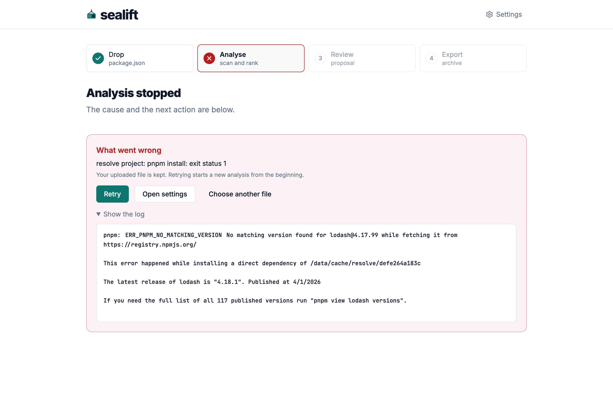

# Troubleshooting

This page lists the messages sealift shows, grouped by where they appear, with their cause and their fix. Search the page for the words on your screen.

When an analysis or an export stops, the cause shows under What went wrong. **Show the log** unfolds what pnpm and Trivy wrote, including their own error codes, which the message leaves out.

## Anywhere

### sealift is not reachable

The browser sent a request and got no answer. The container is stopped, restarting, or the reverse proxy in front of it is down.

Check the container with `docker ps` and its log with `docker logs sealift`, then try again.

### Progress stalls, then jumps to the end

A reverse proxy buffers the event stream. Turn buffering off for sealift: [Deployment](deployment.md#reverse-proxy) has the Caddy and Nginx settings.

## Setup and settings

### could not reach GitHub to look up Trivy releases

sealift asks `api.github.com` for the Trivy releases before it installs or updates Trivy. The machine has no route to GitHub, or a firewall blocks it. [Deployment](deployment.md#outbound-access) lists the hosts sealift needs.

### trivy release is too recent

**Update Trivy** found a latest release younger than the minimum release age. Keep the installed version, or press **Install anyway** to take the latest now.

### trivy asset checksum mismatch

The Trivy archive sealift downloaded does not match the sha256 in the release's checksum file. sealift keeps nothing from it. Retry; if the mismatch stays, something between you and GitHub alters the download.

### tools not ready

The API refuses to create a session or start an analysis while Trivy, its database or the signature key is missing. The answer lists which one. The interface opens the setup screen instead: install what it shows, then continue.

### invalid limits

A limit is out of range. The message names it and the value:

```
invalid limits: download parallelism must be between 1 and 32, not 1000
```

[Settings](settings.md#limits) gives each range.

### Use an exact version, such as 22.17.1.

The Node version must be exact. `22`, `22.x` and `>=22` are refused.

## Drop

### sealift cannot analyse this file yet

The drop preview found entries sealift refuses. Each one shows with its reason:

| Reason | Fix |
| --- | --- |
| version must be exact, such as 1.2.3 | Replace the range or tag with the version the project uses today |
| only npm registry versions are supported | Replace the alias, Git URL or path with a registry version |
| not supported | Remove `overrides`, `resolutions`, `pnpm.overrides` or `pnpm.patchedDependencies` |
| lists no dependency to update | Drop a `package.json` with at least one dependency |

The API gives the same answer to a file sent directly:

<!-- run -->
<!-- expect: version must be exact, such as 1.2.3 -->
```sh
printf '{"name":"demo","dependencies":{"express":"^4.17.1"}}' > /tmp/range.json
curl -s -F manifest=@/tmp/range.json http://localhost:8080/api/projects
```

```json
{"detail":"the manifest has entries sealift cannot analyze","errors":[{"field":"dependencies","name":"express","reason":"version must be exact, such as 1.2.3","value":"^4.17.1"}],"status":400,"title":"invalid package.json","type":"about:blank"}
```

### That file is not valid JSON.

The dropped file does not parse. Check that you dropped the `package.json` itself, not a lockfile or another file.

### That file holds JSON, but not an object like a package.json.

The file parses, but holds an array, a string or a number at its top level.

## Analysis

The message under What went wrong starts with the step that failed, such as `resolve project:`.

### resolve project: pnpm install: exit status 1

pnpm could not install the project as dropped. **Show the log** gives pnpm's own error. The common ones:

| In the log | Cause | Fix |
| --- | --- | --- |
| `ERR_PNPM_NO_MATCHING_VERSION` | A version that does not exist on the registry | Fix the version in the `package.json`, then drop it again |
| `ERR_PNPM_FETCH_404` | A package name that does not exist, or a private package | Fix the name; sealift reads the public registry, or the mirror set in [Deployment](deployment.md#outbound-access) |



### fork/exec /usr/local/bin/node: operation not permitted

sealift could not start pnpm as its `tools` user. The container runs with `no-new-privileges`, or without the `SETUID` and `SETGID` capabilities. [Deployment](deployment.md#compose) has a setup that works.

### Analysis interrupted

The server restarted while the analysis ran, for example during an upgrade. Press **Retry**.

### A dependency with CVEs shows under Nothing to do

No candidate it could propose has fewer CVEs: the ones that would are too recent, excluded by the Node version, deprecated or fail to resolve. Open the row: each candidate shows the signal that blocks it. [How sealift chooses](how-sealift-chooses.md#signals) explains each one.

## Export

### jobs: signatureKey is empty, set it in settings before exporting

No signature key is saved. Save one in the setup screen or in [Settings](settings.md#signature-key).

### jobs: the export selects no version and leaves out the current project, so it would pack nothing

The selection keeps every dependency at its current version, so the archive would be empty. Choose at least one new version in the review.

```json
{"detail":"jobs: the export selects no version and leaves out the current project, so it would pack nothing","status":400,"title":"queue export","type":"about:blank"}
```

### invalid export selection

The selection names a version the analysis did not resolve. This happens through the API, not through the review. The answer names each version:

```json
{"detail":"the selection names versions the analysis did not resolve","errors":[{"field":"selection","name":"express@9.9.9","reason":"not a version the analysis resolved"}],"status":400,"title":"invalid export selection","type":"about:blank"}
```

### jobs: downloaded tarball does not match its recorded integrity, possible tampering

A downloaded package does not match the sha512 the registry published. sealift stops and packs nothing. Retry once; if it fails again, a proxy or mirror between sealift and the registry serves altered files. Do not work around it.

### Stopped at Download and verify each package.

The export could not download a package. The message and the log name it. A registry or proxy that times out or limits connections is the usual cause: lower [download parallelism](settings.md#download-parallelism), then **Retry**.

## Reporting a problem

When none of this helps, open an issue with the sealift version (in `summary.md`, or the image tag), the target platform, the message on screen, and the log from **Show the log**. Remove the signature key and any private package name first.
