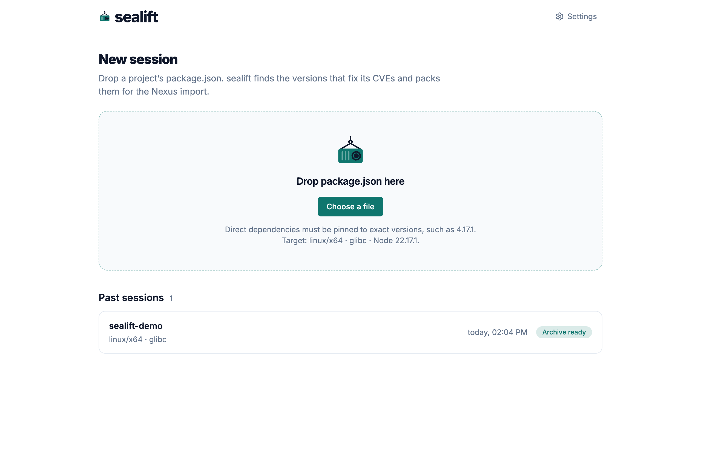
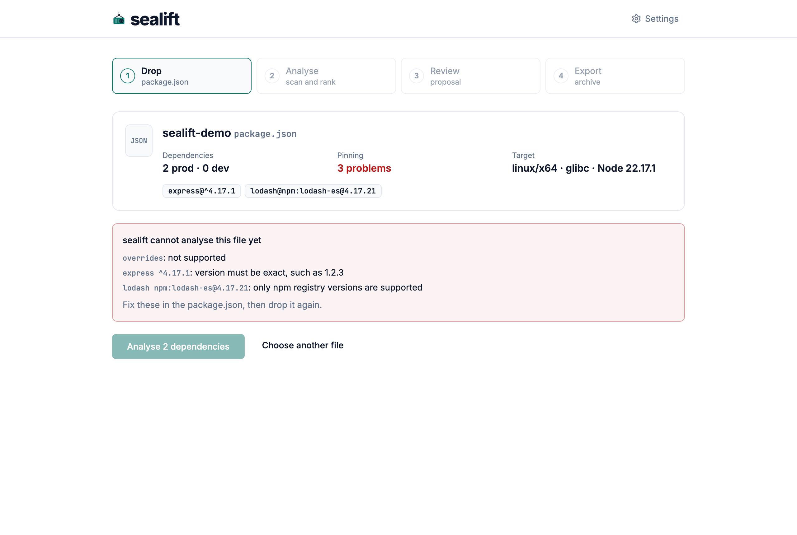
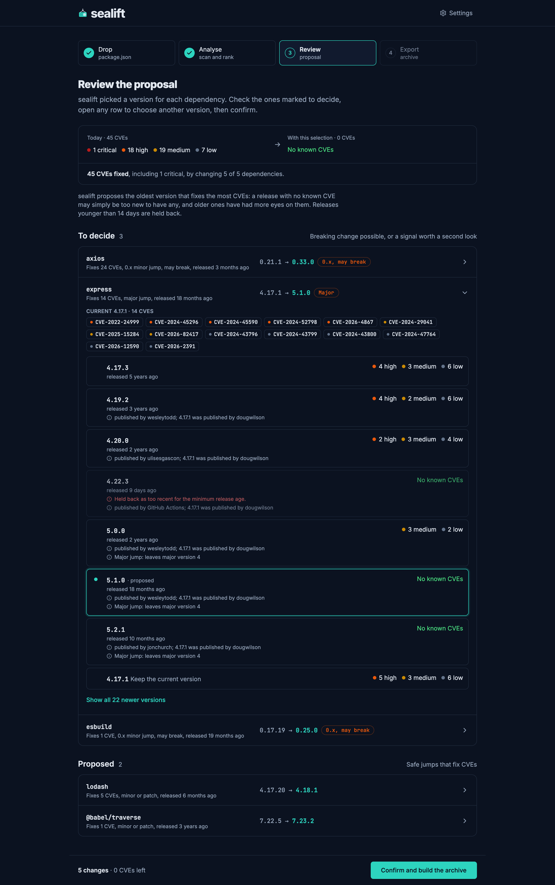
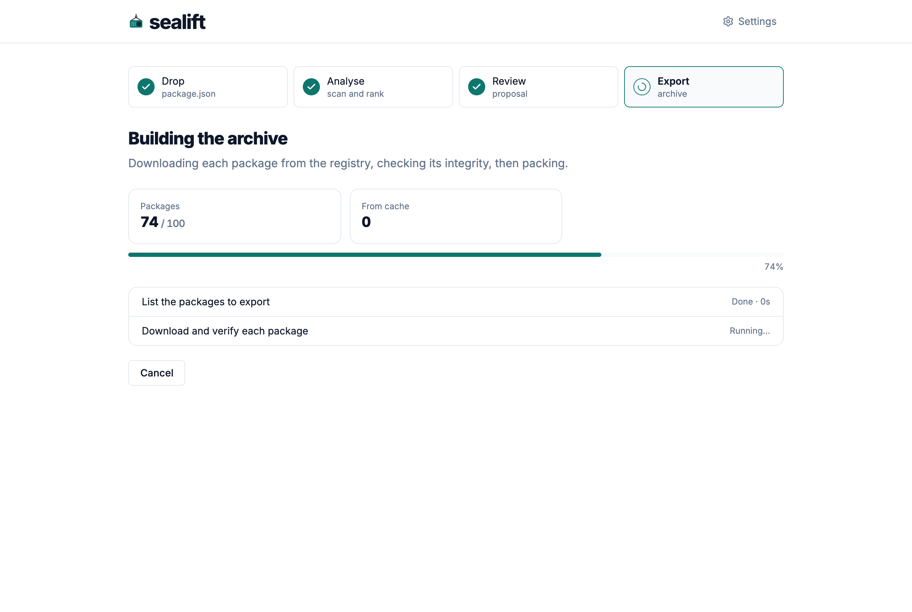

# Workflow

This page walks through each screen of a session, in order, with the label of every button. A session holds one `package.json`, its analysis, and the archives built from it.

The step bar at the top of a session shows Drop, Analyse, Review and Export. A finished step shows a check mark and opens again on a click. A running step shows a spinner, a failed one a cross.

## Setup

The first run opens on Prepare sealift. It lists three things sealift needs, with their state and size:

| Item | Where it comes from |
| --- | --- |
| Trivy | `github.com/aquasecurity/trivy`, checked against its sha256 |
| Vulnerability database | `mirror.gcr.io`, updated every six hours upstream; sealift refreshes it before each analysis |
| Signature key | You: the value your Nexus import project expects in `signature.key` |

**Install Trivy (43.3 MB) and its database (about 120 MB, 1.4 GB once unpacked)** starts both downloads. Nothing downloads before this click. Each row then shows its download running, then the version installed. **Save key** stores the key. **Continue** appears once all three are ready.

When the latest Trivy release is younger than the minimum release age, the button names the newest release past that age instead, such as **Install Trivy 0.73.0 and its database**, and **Install Trivy 0.74.0 anyway** installs the latest. A failed install shows the cause and **Retry**. Until the key is saved, the screen reads Save the signature key to continue.

The setup screen opens again whenever Trivy, its database or the key goes missing, for example after **Clear** in the settings.

## Home

The home screen is New session: a drop zone for a `package.json`, then Past sessions, newest first.

Drop a file on the zone, or press **Choose a file**. The zone repeats the rule sealift applies to every file: direct dependencies must be pinned to exact versions, such as `4.17.1`. It also names the current target.

Each past session shows its name, its target, its date and one status:

| Status | Meaning |
| --- | --- |
| Not analysed yet | The file was dropped; no analysis ran |
| Analysing | The analysis is running |
| Analysis failed | The analysis stopped on an error |
| Awaiting export | The analysis finished; no archive yet |
| Exporting | An export is running |
| Export failed | The last export stopped on an error |
| Archive ready | The last export produced an archive |

A click opens the session on its most useful step: the export for a session with an archive, the review for a finished analysis, the analysis otherwise.

## Drop

The preview reads the file before anything runs. It shows the project name, the count of prod and dev dependencies, the pinning check and the target.

When the file breaks a rule, Pinning shows the number of problems and a list names each one. **Analyse** stays disabled until you fix the file and drop it again.

sealift reads `dependencies`, `devDependencies` and `optionalDependencies`, and refuses:

- a range or a tag instead of an exact version: `^4.17.1`, `~4.17.1`, `latest` (version must be exact, such as 1.2.3);
- a version from anywhere but the npm registry: `npm:`, `git+`, `github:`, `file:`, `link:`, `workspace:`, `http:` or `https:` (only npm registry versions are supported);
- the fields `overrides`, `resolutions`, `pnpm.overrides` and `pnpm.patchedDependencies` (not supported);
- a file with no dependency (lists no dependency to update).

Dropping a file that an earlier session already used, byte for byte, opens You already analysed this file. It says how that session ended. **Resume that session** opens it; **Start a new session** analyses the file again with fresh data.

**Analyse 5 dependencies** starts the analysis. **Choose another file** clears the preview.

## Analysis

The analysis runs nine steps. Each shows a check mark and its duration once done.

1. Check the manifest
2. Prepare pnpm and Trivy
3. Resolve the project
4. Scan for known CVEs
5. List newer versions
6. Resolve candidate versions
7. Scan candidate versions
8. Rank and propose
9. Check the combined install

Resolve candidate versions takes most of the time: sealift installs each newer version of each dependency against the whole project. A counter shows the candidates resolved so far and the time left. You can leave the page; the session keeps running on the server.

**Cancel** asks Cancel this analysis? before it stops. A cancelled analysis reads Analysis cancelled, with **Start it again**.

When a step fails, the screen reads Analysis stopped, with the cause under What went wrong and the actions that fit:

- **Retry** starts the analysis again from the beginning, with the same file.
- **Open settings** opens the settings panel, to change the target or a limit before retrying.
- **Choose another file** goes back to the drop screen.
- **Show the log** unfolds everything pnpm and Trivy wrote, with the error code the message above leaves out.

[Troubleshooting](troubleshooting.md) lists each message and its fix.

## Review

The review opens on sealift's proposal. The summary compares the CVEs today with the CVEs left with the selection, by severity, and counts the dependencies that change.

Dependencies fall into three groups:

| Group | Holds |
| --- | --- |
| To decide | A proposal that may break: a major jump, a 0.x minor jump, or a signal worth a second look |
| Proposed | Safe jumps that fix CVEs |
| Nothing to do | No CVE, or no newer version helps |

A row names the dependency, the CVEs its proposal fixes, the kind of jump, the release age, and the change from the current version to the proposed one. A click opens it:

- Current lists the CVE ids of the current version.
- The key candidates follow, each with its CVE counts by severity, its release age and its signals. The proposed one reads proposed.
- A release younger than the minimum release age reads Held back as too recent for the minimum release age, and cannot be chosen.
- **Keep the current version** leaves the dependency as it is.
- **Show all 22 newer versions** lists every candidate; **Show fewer versions** folds them again.

[How sealift chooses](how-sealift-chooses.md) explains the proposal and each signal.

The bar at the bottom counts the changes and the CVEs left. **Confirm and build the archive** starts the export with the selection.

The review also comes in dark:

## Export

The export runs five steps: List the packages to export, Download and verify each package, Strip publishConfig, Pack and sign the archive, Write the reports. While it runs, it counts the packages downloaded, those served from the cache, and the percentage done.

**Cancel** asks Cancel this export? before it stops. A cancelled export reads Export cancelled, with **Start the export again**. A failed one reads Export failed and names the step, with **Retry** and **Choose different versions**, which returns to the review.

A finished export reads Archive ready:

- the archive card shows Sealed, the package count, the size, and the sha256 with **Copy**;
- **Download archive** downloads `packages_npm.tar.gz`;
- Reports lists five files, each with **Download**: `findings.csv`, `manifest.json`, `report.cdx.json`, `report.trivy.json`, `summary.md`.

**Export another selection** returns to the review to build a second archive from the same analysis. The earlier one stays below, under Earlier archive from this analysis. **Start a new session** returns home.

[The air gap](air-gap.md) covers what to do with these files.

## Settings

**Settings**, in the header, opens a side panel over the current screen. [Settings](settings.md) describes each one.
